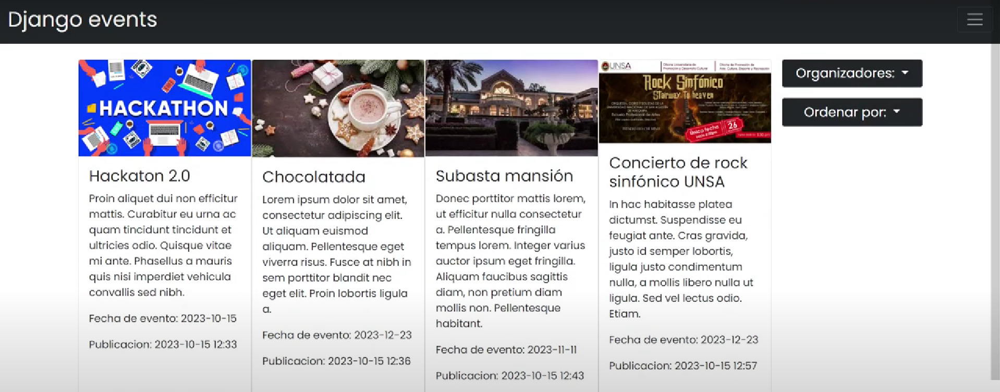
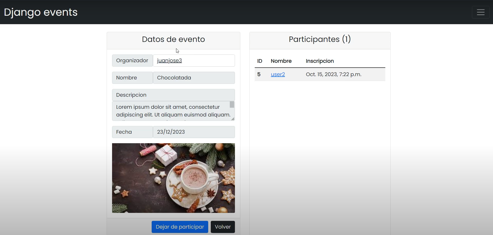
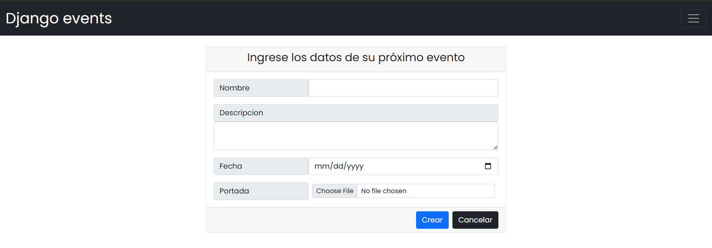
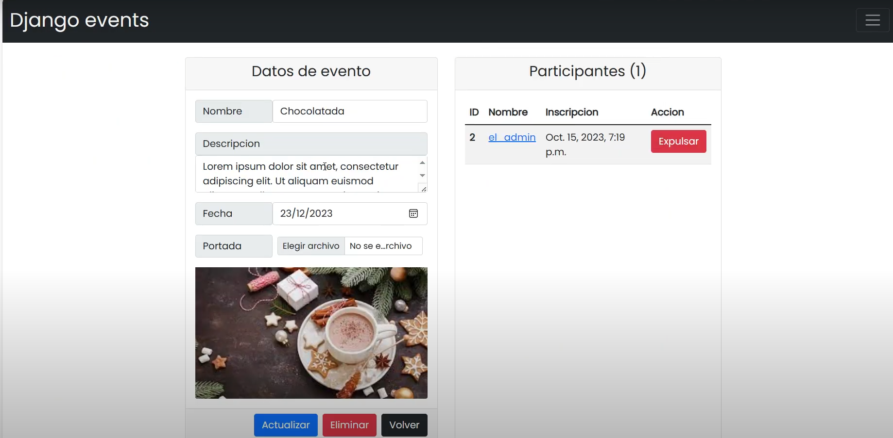
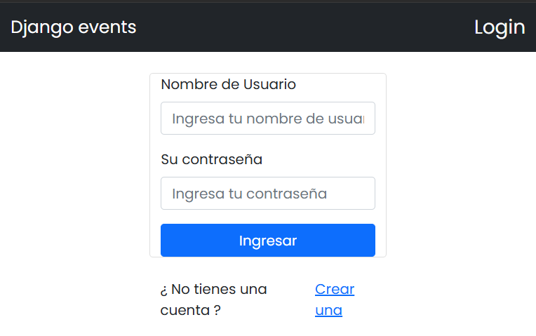
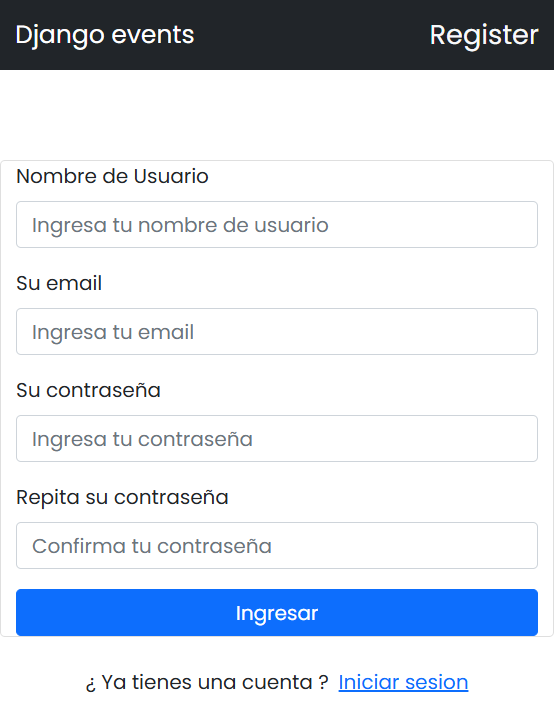

# 📅 Event Management System

   

A web-based event management system built with Django, allowing users to create, manage, and participate in events.

---

## 🌟 Features

✅ **User Authentication** – Register and log in securely.  
✅ **Event Creation** – Users can create and manage events.  
✅ **Event Registration** – Users can sign up for events.  
✅ **Sorting & Filtering** – Events can be organized by date, name, or organizer.  
✅ **Image Upload** – Events can have cover images stored in the `media/` directory.  

---

## 🏗️ Installation

### 1️⃣ Clone the Repository
```bash
$ git clone https://github.com/Derek486/django-events-management.git
$ cd django-events-management
```

### 2️⃣ Create a Virtual Environment & Install Dependencies
```bash
$ python -m venv venv
$ source venv/bin/activate  # On Windows use `venv\Scripts\activate`
$ pip install -r requirements.txt
```

### 3️⃣ Apply Migrations & Run the Server
```bash
$ python manage.py migrate
$ python manage.py runserver
```

### 4️⃣ Access the Application
Go to [http://127.0.0.1:8000/](http://127.0.0.1:8000/) in your browser.

---

## 🏛️ Project Structure
```
.
├── eventos
│   ├── models.py    # Database models
│   ├── views.py     # Views for handling requests
│   ├── urls.py      # URL routing
│   ├── templates/   # HTML templates
│   └── static/      # CSS, JS, and images
├── events_management_app
│   ├── settings.py  # Django settings
│   ├── urls.py      # Root URL configuration
│   └── wsgi.py      # WSGI entry point
├── media
│   ├── portadas_eventos/  # Event cover images
├── db.sqlite3       # SQLite database
└── manage.py        # Django command-line utility
```

---

## 📜 Database Models

### 👤 User (`Usuario`)
```python
class Usuario(AbstractUser):
    email = models.EmailField(unique=True)
```

### 🎟️ Event (`Evento`)
```python
class Evento(models.Model):
    autor = models.ForeignKey(Usuario, on_delete=models.CASCADE)
    nombre = models.CharField(max_length=100)
    descripcion = models.TextField()
    fecha = models.DateField()
    portada = models.ImageField(upload_to='portadas_eventos/', null=True, blank=True)
```

### 📝 Registration (`RegistroEvento`)
```python
class RegistroEvento(models.Model):
    usuario = models.ForeignKey(Usuario, on_delete=models.CASCADE)
    evento = models.ForeignKey(Evento, on_delete=models.CASCADE)
    fecha_registro = models.DateTimeField(auto_now_add=True)
```

---

## 🖼️ Preview

### 📌 Event Listings & Details
<p align="center">
  
  
</p>

### 🎉 Create & Manage Events
<p align="center">
  
  
</p>

### 🔐 User Authentication
<p align="center">
  
  
</p>

---

## 📜 License
This project is licensed under the MIT License - see the [LICENSE](LICENSE) file for details.